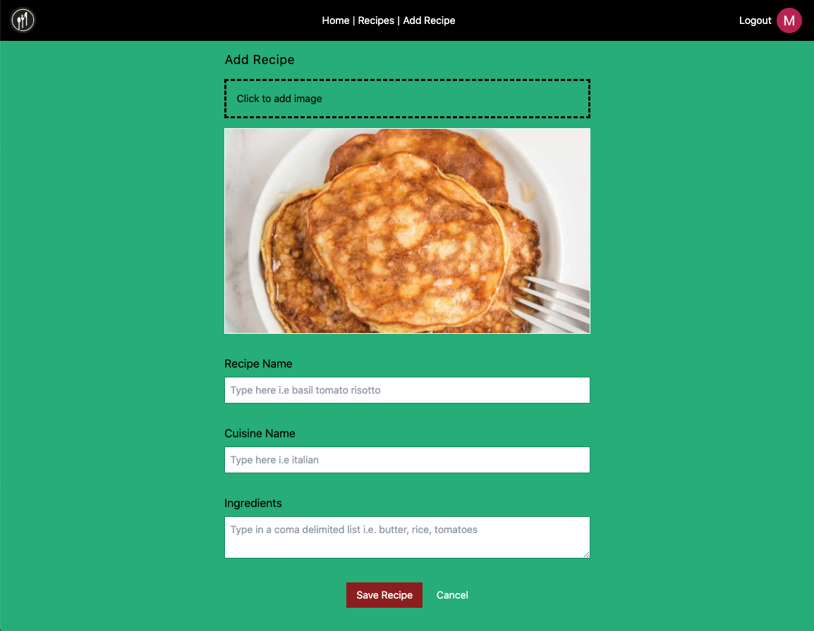

# Recipe Mix app

A CRUD like app to aggregate recipes and enable user to collate weekly shopping list based on the selection.

## Installation

- Clone project, run `yarn` in terminal
- Run `yarn dev` to start the project
- Visit `http://localhost:3000`

## Preview

## Tech stack

- React, Next, Typescript (core tech)
- PostgreSQL instance with Railway (data persistance)
- Prisma, GraphQL, Apollo Client (schema, data provider)
- CSS, Tailwind, Storybook (styling, components library)
- React Testing Library, Cypress (testing)
- Cloudinary (hosting images)
- NextAuth (authentication)
- Vercel (deployment)
- React Hook Form (forms library)
- Semantic, accessible, responsive (general requirements)

## Notes

If problems downgrade to Node 16.8.0 (use nvm)

Add .env file with variables

```
CLOUDINARY_SECRET=""
NEXT_PUBLIC_CLOUDINARY_KEY=""
NEXT_PUBLIC_CLOUDINARY_CLOUD_NAME=""

DATABASE_URL="postgresql://..."

GOOGLE_CLIENT_ID=
GOOGLE_CLIENT_SECRET=

NEXT_AUTH_URL=http://localhost:3000
```

(The below can be generated in command line `openssl rand -base64 32`)

```
JWT_SECRET=
```

## Errors

Error: Cannot find module '.prisma/client/index'

Recreate prisma client `./node_modules/.bin/prisma2 generate`
May need to delete node_modules and install again `rm -rf node_modules && yarn`

Duplicate "graphql" modules cannot be used at the same time since different
versions may have different capabilities and behavior. The data from one
version used in the function from another could produce confusing and
spurious results.

Make sure there is just one graphql dependency and remove duplicate from packaga.json manually
Delete node_modules and install again `rm -rf node_modules && yarn`

## Screenshot


